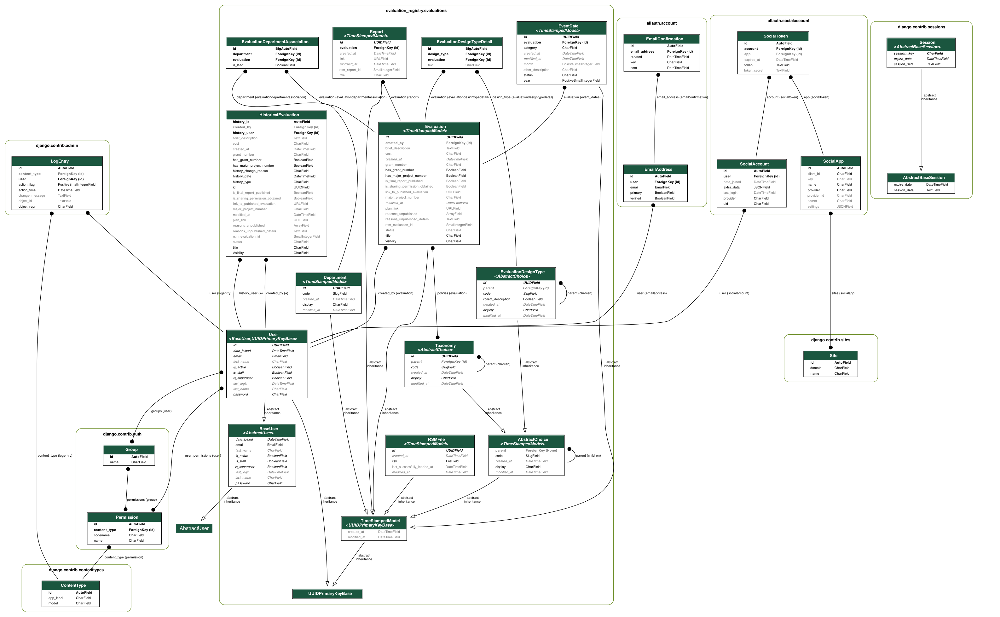

# Evaluation Registry

The [Evaluation Task
Force](https://www.gov.uk/government/organisations/evaluation-task-force) is a
joint Cabinet Office-HM Treasury unit providing specialist support to ensure
evidence and evaluation sits at the heart of spending decisions.

The Evaluation Registry is where planned, ongoing or complete evaluation reports can be shared.

## Using Docker

1. [Install Docker](https://docs.docker.com/get-docker/) on your machine
2. `docker-compose up --build --force-recreate web`
3. It's now available at: http://localhost:8020/

Migrations are run automatically at startup, and suppliers are added automatically at startup

## Running locally
This project uses [poetry](https://python-poetry.org/) to manage its dependencies, if it is not installed then install
now:

```commandline
curl -sSL https://install.python-poetry.org | python3 -
```

Install the necessary dependencies (if they have changed):
```commandline
poetry install
```

Run the server:
```commandline
export $(cat envs/web | xargs) POSTGRES_HOST=localhost && poetry run python manage.py runserver
```


## Running tests

```commandline
docker-compose up -d db
POSTGRES_HOST=localhost poetry run pytest tests . --cov=evaluation_registry  --cov-fail-under 70
```

or

```commandline
make test
```

## Checking code
```commandline
make check-python-code
```

## Database schema

Regenerate this diagram after running `migrate` by invoking `manage.py generate_erd`. (You will need `graphviz` installed: see [`pydot` docs](https://pypi.org/project/pydot/)).



## Updating the front end build
```commandline
cd web
npm install
npm run build
```
